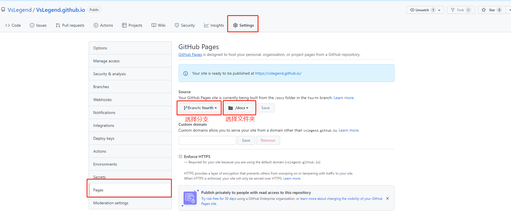

# Docsify
非常简约的网站文档生成器，只需要较少的配置就可以实现个人博客的搭建。
由于它是通过加载网页时动态生成，使得它的网页打开速度较慢。


<br><br>
---
# 快速开始
https://docsify.js.org/#/quickstart

- 安装node.js 执行下面命令
```yaml
npm i docsify-cli -g
```


- 跳转指定文件目录
```yaml
cd /目录
```

- 初始化文件
```yaml
docsify init ./docs
```

- 启动本地服务查看页面
```yaml
docsify serve docs
```

<br><br>
---
# 个性化设置
## 添加侧边栏
修改index.html文件，添加**loadSidebar: true**
```html
<script>
  window.$docsify = {
    loadSidebar: true
  }
</script>
```

在docs中创建_sidebar.md文件，添加引用就行
```markdown
* [Home](/)
* [READ](java/read.md)
```


## 通过侧边栏设置页面标题
通过侧边栏可以快速全局的为所有页面设置其页面标题
```markdown
* [Home](/ "首页")
* [READ](java/read.md "快速阅读")
```

## 侧边栏显示文章的小标题
修改index.html文件，添加**subMaxLevel: 2**
```html
<script>
  window.$docsify = {
    loadSidebar: true,
    subMaxLevel: 2
  }
</script>
```

如果需要在侧边栏屏蔽某个标题，添加如下内容到标题后
```html
<!-- {docsify-ignore} -->
```

或者输入如下内容，在侧边栏屏蔽文章的所有标题
```html
<!-- {docsify-ignore-all} -->
```

## 设置封面
修改index.html文件，添加**coverpage: true**

到目前为止，脚本内容如下
```html
  <script>
    window.$docsify = {
      name: '',
      repo: '',
      // 侧边栏
      loadSidebar: true,
      alias: {
        '/.*/_sidebar.md': '/_sidebar.md'
      },
      // 侧边栏的映射标题至二级
      subMaxLevel: 2,
      coverpage: true
    }
  </script>
```


---
# 上传Github
提交分支，并进行如下设置



