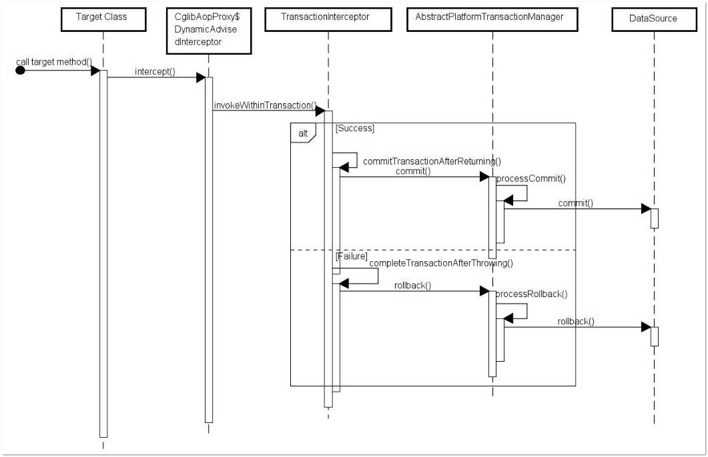

# 声明式事务注解:@Transactional

## Spring注解@Transactional的实现机制
在应用系统调用声明@Transactional 的目标方法时，Spring Framework 默认使用 AOP 代理，在代码运行时生成一个代理对象，
根据@Transactional 的属性配置信息，这个代理对象决定该声明@Transactional 的目标方法是否由拦截器 TransactionInterceptor 来使用拦截，
在 TransactionInterceptor 拦截时，会在在目标方法开始执行之前创建并加入事务，并执行目标方法的逻辑, 
最后根据执行情况是否出现异常，利用抽象事务管理器AbstractPlatformTransactionManager 操作数据源 DataSource 提交或回滚事务。



<br><br>

## 事务使用方法
使用@Transactional注解管理事务的实现步骤分为三步。

- 配置数据源：把一个DataSource（如DruidDataSource）作为一个@Bean注册到Spring容器中，配置好事务性资源。

- 启用Spring事务管理器：在 xml 配置文件中添加事务配置信息。除了用配置文件的方式，@EnableTransactionManagement注解也可以启用事务管理功能。

- 使用事务功能：将@Transactional 注解添加到用以事务的方法上，并设置合适的属性信息。

```xml
<bean id="transactionManager"
class="org.springframework.jdbc.datasource.DataSourceTransactionManager">
<--这里引用的是数据源的bean--!>
    <property name="dataSource" ref="dataSource" />
</bean>
```

<br><br>

## 源码以及属性作用
> @Transactional 注解也可以添加到类级别上，此时该注解默认适用于该类以及该类所有子类的公共方法上。表示所有该类的公共方法都配置相同的事务属性信息。
>
> 方法级别的事务属性信息会覆盖类级别的相关配置信息。

```java
@Target({ElementType.TYPE, ElementType.METHOD})
@Retention(RetentionPolicy.RUNTIME)
@Inherited
@Documented
public @interface Transactional {

	@AliasFor("transactionManager")
	String value() default "";

	@AliasFor("value")
	String transactionManager() default "";

	Propagation propagation() default Propagation.REQUIRED;

	Isolation isolation() default Isolation.DEFAULT;

	int timeout() default TransactionDefinition.TIMEOUT_DEFAULT;

	boolean readOnly() default false;

	Class<? extends Throwable>[] rollbackFor() default {};

	String[] rollbackForClassName() default {};

	Class<? extends Throwable>[] noRollbackFor() default {};

	String[] noRollbackForClassName() default {};

}
```


⭐ name	当在配置文件中有多个 TransactionManager , 可以用该属性指定选择哪个事务管理器。

⭐ propagation	事务的传播行为，默认值为 REQUIRED。

⭐ isolation	事务的隔离度，默认值采用 DEFAULT。

⭐ timeout	事务的超时时间，默认值为-1。如果超过该时间限制但事务还没有完成，则自动回滚事务。

⭐ read-only	指定事务是否为只读事务，默认值为 false；为了忽略那些不需要事务的方法，比如读取数据，可以设置 read-only 为 true，有时候为只读查询提供事务管理机制是为了使用mybatis的本地缓存。

⭐ rollback-for	用于指定能够触发事务回滚的异常类型，如果有多个异常类型需要指定，各类型之间可以通过逗号分隔。

⭐ no-rollback- for	抛出 no-rollback-for 指定的异常类型，不回滚事务。

<br><br>

 
## 事务传播机制-propagation
**物理事务与逻辑事务**：

事务性资源实际打开的事务就是物理事务，如数据库的Connection打开的事务。Spring会为每个@Transactional方法创建一个事务范围，可以理解为是逻辑事务。

在逻辑事务中，大范围的事务称为外围事务，小范围的事务称为内部事务，外围事务可以包含内部事务，但在逻辑上是互相独立的。每一个这样的逻辑事务范围，都能够单独地决定rollback-only状态。

那么如何处理逻辑事务和物理事务之间的关联关系呢，这就是传播特性解决的问题。

**事务的传播类型**：

1. @Transactional默认传播类型为PROPAGATION_REQUIRED。类似于同名的EJB事务属性。

2. TransactionDefinition.PROPAGATION_MANDATORY：支持当前事务；如果不存在当前事务，则抛出一个异常。

3. TransactionDefinition.PROPAGATION_NESTED：如果存在当前事务，则在一个嵌套的事务中执行。

> 使用同一个物理事务，带有多个保存点，可以回滚到这些保存点，可以认为是部分回滚，这样一个内部事务范围触发了一个回滚，外围事务能够继续这个物理事务，尽管有一些操作已经被回滚。典型地，它对应于JDBC的保存点，所以只对JDBC事务资源起作用。


4. TransactionDefinition.PROPAGATION_NEVER：非事务执行，如果存在事务，则引发异常。

5. TransactionDefinition.PROPAGATION_SUPPORTS：支持当前事务，如果不存在则非事务执行。这样的一个逻辑事务范围，它背后可能没有实际的物理事务，此时的事务也成为空事务。

6. TransactionDefinition.PROPAGATION_NOT_SUPPORTED：以非事务方式执行，如果当前事务存在，则挂起当前事务。

7. TransactionDefinition.PROPAGATION_REQUIRED：支持当前事务；如果不存在事务，则创建一个新的事务。强制要求要有一个物理事务。

> 如果没有已经存在的事务，就专门打开一个事务用于当前范围。或者参与到一个已存在的更大范围的外围事务中。在相同的线程中，这是一种很好的默认方式安排。
> 例如，一个service外观/门面代理到若干个仓储方法，所有底层资源必须参与到service级别的事务里
> 
> 在标准的REQUIRED行为情况下，所有这样的逻辑事务范围映射到同一个物理事务。因此，在内部事务范围设置了rollback-only标记，确实会影响外围事务进行实际提交的机会。
> 
> 注：默认，一个参与到外围事务的事务，会使用外围事务的特性，安静地忽略掉自己的隔离级别，超时值，只读标识等设置。
> 当然可以在事务管理器上设置validateExistingTransactions标识为true，这样当你自己的事务和参与到的外围事务设置不一样时会被拒绝。

8. TransactionDefinition.PROPAGATION_REQUIRES_NEW：创建一个新事务，如果当前存在事务，则同时暂停当前事务。

> 与REQUIRED相比，总是使用一个独立的物理事务用于每一个受影响的逻辑事务范围，从来不参与到一个已存在的外围事务范围。
> 这样安排的话，底层的事务资源是不同的，因此，可以独立地提交或回滚。外围事务不会被内部事务的回滚状态影响。
> 这样一个独立的内部事务可以声明自己的隔离级别，超时时间和只读设置，并不继承外围事务的特性。

9. TransactionDefinition.TIMEOUT_DEFAULT：使用默认超时的底层事务系统，或者如果不支持超时则没有。

<br><br>

## 事务的隔离级别-isolation
如下隔离级别跟数据库隔离级别相同，其它信息可见MySQL部分。写读是脏读，读写读是不可重复读，where insert where是幻读。


- TransactionDefinition.ISOLATION_DEFAULT：这是默认的隔离级别。跟随底层数据库的隔离规则。MySQL的默认隔离级别是REPEATABLE-READ，即可重复读。

- TransactionDefinition.ISOLATION_READ_COMMITTED：已提交读。能够阻止胀读；可能发生不可重复读和幻读。

- TransactionDefinition.ISOLATION_READ_UNCOMMITTED：读未提交。可能发生胀读、不可重复读和幻读。

- TransactionDefinition.ISOLATION_REPEATABLE_READ：可重复读，能够阻止胀读和不可重复读；可能发生幻读。

- TransactionDefinition.ISOLATION_SERIALIZABLE：可串行化，胀读、不可重复读和虚读都不会发生。产生锁竞争，造成性能压力以及大量超时。

<br><br>

## 事务回滚-rollback
rollback参数用于指定抛出何种异常时才进行回滚，适用于该异常类的子类。默认配置下 Spring 只会回滚RuntimeException异常或者 Error。

> **checked异常和unchecked异常**：
>
> checked异常继承Exception，主要是程序外部引起的异常，如无效用户输入，文件不存在，网络IOException或数据库链接SQLException错误。
>
> unchecked异常继承RuntimeException（继承Exception），主要是逻辑异常，IllegalArgumentException, NullPointerException和IllegalStateException等异常。

<br><br>

## SpringAOP的自调用问题
在 Spring 的 AOP 代理下，只有目标方法由外部调用，目标方法才由 Spring 生成的代理对象来管理，这会造成自调用问题。
若同一类中的其他没有@Transactional 注解的方法内部调用有@Transactional 注解的方法，有@Transactional 注解的方法的事务被忽略，不会发生回滚。
```java
@Service
public class OrderService {
    public void insert() {
       insertOrder();
    }
    @Transactional
    public void insertOrder() {
        // doSomething
    }
}
```

insertOrder 尽管有@Transactional 注解，但它被内部方法 insert 调用，事务被忽略，出现异常事务不会发生回滚。
上面的两个问题@Transactional 注解只应用到 public 方法和自调用问题，是由于使用 Spring AOP 代理造成的。为解决这两个问题，使用 AspectJ 取代 Spring AOP 代理。

<br><br>

## 事务注意事项
事务只能用在能见度为public的方法、接口或类上，用在private或protect上时，不会报错，也不会生效

PROPAGATION_SUPPORTS当前不存在事务时不会回滚事务，而PROPAGATION_NOT_SUPPORTED、PROPAGATION_NEVER这二者都不会回滚事务。

事务可以用在接口、类、方法上。Java的注解不能从接口继承，因此用在接口上时，必须使用基于接口的代理才行，即JDK动态代理。用在类上时，相当于该类以及该类子类都默认使用了该注解。用在方法上时，可以覆盖类上的配置。

